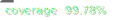

# Event Sync

   

This is still a work in progress, the first version will be released soon.

Event sync is a library for building offline first applications that sync with a server and leverage
event sourcing and domain driven design patterns. It was specifically built for use with React
Native and Node but may be usable in any JavaScript environment.
